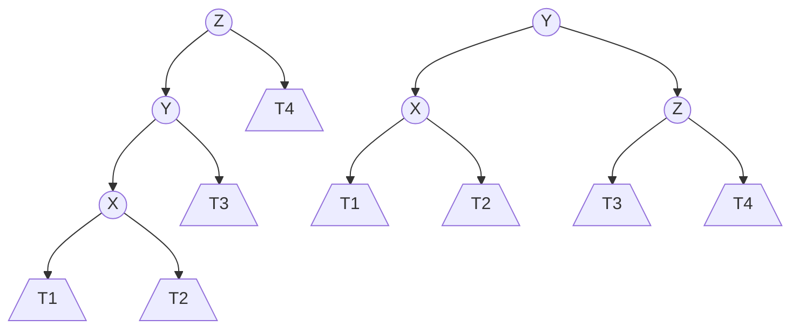
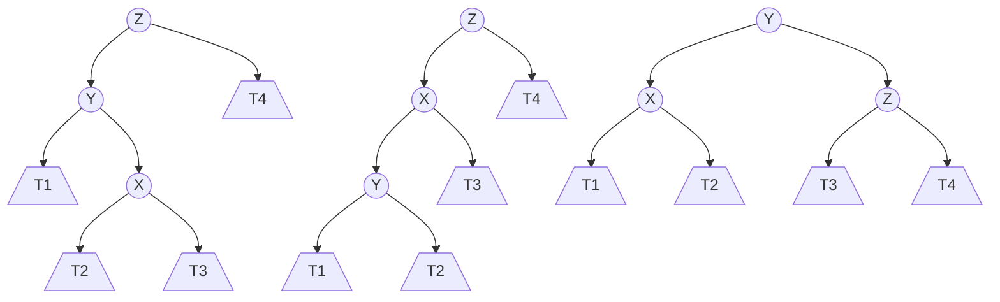

## AVL Tree Rotations
#### Left Left

```mermaid
graph TD;

id1((Z)) --> id2((Y));
id2((Y)) --> id3((X));

id3((X)) --> id4[/T1\];
id3((X)) --> id5[/T2\];

id2((Y)) --> id6[/T3\];
id1((Z)) --> id7[/T4\];


id10((Y)) --> id20((X));
id10((Y)) --> id30((Z));

id20((X)) --> id40[/T1\];
id20((X)) --> id50[/T2\];

id30((Z)) --> id60[/T3\];
id30((Z)) --> id70[/T4\];

```

#### Left Right

```mermaid
graph TD;

id1((Z)) --> id2((Y));
id2((Y)) --> id3[/T1\];
id2((Y)) --> id4((X));

id4((X)) --> id5[/T2\];
id4((X)) --> id6[/T3\];

id1((Z)) --> id7[/T4\];


id10((Z)) --> id20((X));
id20((X)) --> id30((Y));

id30((Y)) --> id40[/T1\];
id30((Y)) --> id50[/T2\];

id20((X)) --> id60[/T3\];
id10((Z)) --> id70[/T4\];


id100((Y)) --> id200((X));
id100((Y)) --> id300((Z));

id200((X)) --> id400[/T1\];
id200((X)) --> id500[/T2\];

id300((Z)) --> id600[/T3\];
id300((Z)) --> id700[/T4\];


```

## Heap Insertion and Deletion

## Calculating Probability

## Quick Sort

## Regex

