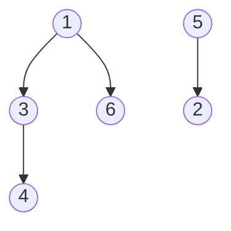
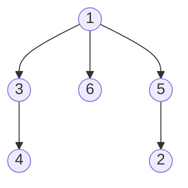

**Minimum Spanning Tree** - A tree spanning all nodes in a graph with minimum total length
## Prims Algorithm
Variant of Dijkstra Algorithm

- Starting with any node, $S = {s}$, $S$ is the current searched space
- Instead of the distance like in Dijkstra, use the attachment cost, $c(v) := min_{u \in S} \s\s l(u, v)$
- At each step we add a node $v$ with the minimum const $c(v)$ to $S$

$l(u: node, v: node)$ - edge between nodes weight/length

```psuedo
Set cost(s) = 0, and cost(v) = \inf for all v != s
Let Q be a priority queue over V with priority decreasing in cost(v)
Initialize set of explored nodes S = \emptyset
While (Q is not empty)
	Extract the node u with minimum cost(u) from Q
	Add u to S
	for (edge e=(u, w) incident to u)
		if (w is not in S)
			Update priority of w as c(w) = min(l(u, w), c(w))
```

Running time with priority queue - $O((m+n) \log n)$, same as Dijkstra for same reasoning 

Running time with Fibonacci heap - $O(m + n\log n)$

Faster in dense graphs, when $m \sim n^2$
## Kruskal's Algorithm
- Sort the edges from least to greatest in their edge length/weight
- Successively pick the edge with the minimum length if it doesn't create a cycle

For each considered edge, the cycle detection is the part that takes long for this algorithm
- Run BFS or DFS, if visits a node twice, cycle detected, naive implementation
- Use union find to check if this creates a cycle, optimized implementation

Running time with basic implementation - $O(m \log m + (m (n+m)))$????

Running time with Union-Find - $O(m \log m)$ for sorting $+ \s O(m \log n)$ for union find
- This simplifies to $O(m \log n)$ because if assume $m=n^2$ then, $m \log n^{2} = 2m \log n$, then $O(3m \log n) = O(m \log n)$

Faster in sparce graph, when $m << n$

#### Union-Find / Disjoin-Set Data Structure
A set of objects to group them based on some criteria

**Find($u$)** - Finds the group containing $u$
**Union($u, v$)** - Merges the groups containing $u$ and $v$


- $Find[3] = Find[4] = Find[6] = Find[1] = 1$
- $Parent[1] = 1, Parent[3] = 1, Parent[4] = 3, Parent[6] = 1$
- $Find[2] = Find[5] = 5$
- $Parent[5] = 5, Parent [2]=5$

$Union(1,2) = Parent[Find[2]] = Find[1]$
- Adding 2's connected component to 1's connected component
- First finds 2's root of its connected component $Find[2]$
- Set 2's root's connected component (5) to have a parent of 1's connected component (1) 


for the union function, simply changing that one root's parent (it was itself as a root, but now it is apart of the bigger tree), changing that roots parent causes all its children's recursions to be ran through the bigger tree now, that's why you don't have to change all of that roots parents.

## Reverse-Delete Algorithm

- Sort the edges from greatest to least in their edge length/weight
- Start with the full graph
- Successively delete the edge with the maximum length as long as it does not disconnect the graph
## Optimality

**Graph Cut** - Partitioning the nodes into two sets $S$ and $V-S$
- There are $2^{n-1}$ cuts in a graph not including the non-trivial cases of empty tree or the a full tree

**Cut Property** - Let $S$ be any subset of nodes and let $e$ be the shortest edge with exactly one endpoint in $S$. Then the MST $T^*$ contains $e$
- The graphs vertices $V$ are partitioned into two sets $S$ and $V - S$, the cut is where these two sets are partitioned, an edge crosses the cut if it has one endpoint in $S$ and another in $V - S$. Among all these edges across the cut, the one with the smallest weight is guaranteed to be part of at least one MST
- This property guarantees that the locally optimal greedy choice of picking the minimum-weight edge across a cut is guaranteed to be in the constructed MST
- Proof by contradiction

**Prims Optimality using Cut Property**
- Start with a single vertex (arbitrarily chosen) and consider it part of the MST
- At each step, consider the cut defined by -
	- $S$ - The set of vertices already in the MST
	- $V - S$ - The set of vertices not yet in the MST
- Among all the edges crossing this cut, the cut property ensures that the one with the lowest weight will be an edge in the MST
- Repeat until all vertices are included in the MST

**Kruskal's Optimality using Cut Property**
- Sort all edges in decreasing order of weight
- Initialize an empty MST and use a Union Find structure to track connected components
- For each edge in sorted order, if adding it does not create a cycle (its endpoints are in different connected components in the Union Find), add it to the MST and Union the components
- To prove optimality, consider the moment when an edge $e = (u, v)$ is added to the MST, at this point $u$ and $v$ belong to different connected components, say $S$ and $V-S$
	- These components define a cut in the graph, since the edges are sorted in decreasing order, and you got the edge from this list, you have the minimum edge connecting these components, any edge with a lower weight would have already been considered earlier and either added or rejected