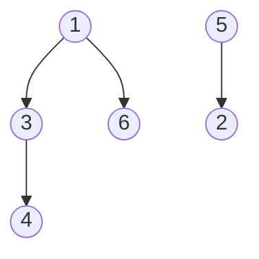

**Minimum Spanning Tree** - A tree spanning all nodes in a graph with minimum total length
## Prims Algorithm
Variant of Dijkstra Algorithm

- Starting with any node, $S = {s}$, $S$ is the current searched space
- Instead of the distance like in Dijkstra, use the attachment cost, $c(v) := min_{u \in S} \s\s l(u, v)$
- At each step we add a node $v$ with the minimum const $c(v)$ to $S$

$l(u: node, v: node)$ - edge between nodes weight/length

```psuedo
Set cost(s) = 0, and cost(v) = \inf for all v != s
Let Q be a priority queue over V with priority decreasing in cost(v)
Initialize set of explored nodes S = \emptyset
While (Q is not empty)
	Extract the node u with minimum cost(u) from Q
	Add u to S
	for (edge e=(u, w) incident to u)
		if (w is not in S)
			Update priority of w as c(w) = min(l(u, w), c(w))
```

Running time with priority queue - $O((m+n) \log n)$, same as Dijkstra for same reasoning 

Running time with Fibonacci heap - $O(m + n\log n)$

## Kruskal's Algorithm

- Sort the edges from least to greatest in their edge length/weight
- Successively pick the edge with the minimum length if it doesn't create a cycle

For each considered edge, the cycle detection is the part that takes long for this algorithm
- Run BFS or DFS, if visits a node twice, cycle detected

Running time with basic implementation - $O(m \log m + (m (n+m)))$????

Running time with Union-Find - $O(m \log m)$ for sorting $+ \s O(m \log n)$
- This simplifies to $O(m \log n)$ because if assume $m=n^2$ then, $m \log n^{2} = 2m \log n$, then $O(3m \log n) = O(m \log n)$

#### Union-Find Data Structure
A set of objects to group them based on some criteria

**Find($u$)** - Finds the group containing $u$
**Union($u, v$)** - Merges the groups containing $u$ and $v$



# TODO 

for the union function, simply changing that one root's parent (it was itself as a root, but now it is apart of the bigger tree), changing that roots parent causes all its children's recursions to be ran through the bigger tree now, that's why you don't have to change all of that roots parents.

## Reverse-Delete Algorithm

- Sort the edges from greatest to least in their edge length/weight
- Start with the full graph
- Successively delete the edge with the maximum length as long as it does not disconnect the graph


## Optimality

**Graph Cut** - Partitioning the nodes into two sets $S$ and $V-S$
- There are $2^{n-1}$ cuts in a graph not including the non-trivial cases of empty tree or the a full tree

**Cut Property** - Let $S$ be any subset of nodes and let $e$ be the shortest edge with exactly one endpoint in $S$. Then the MST $T^*$ contains $e$
- Proof by contradiction